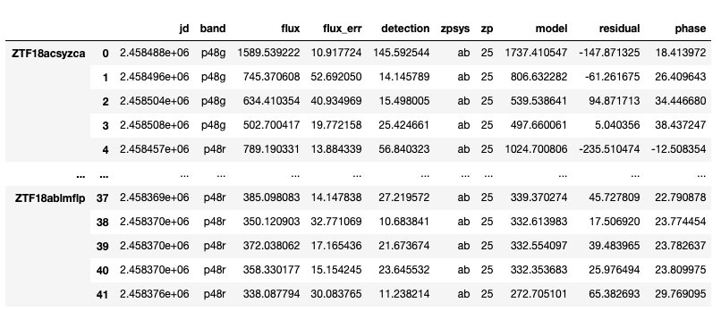
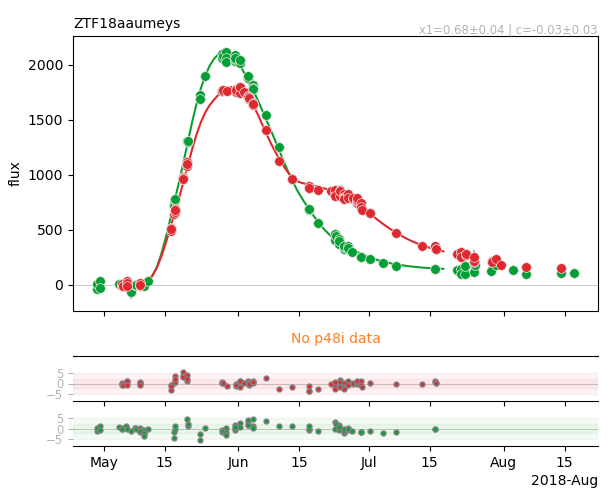
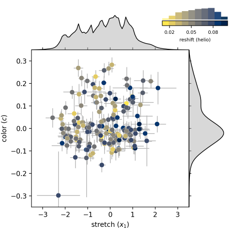

# ztfcosmodr
DataRelease repository for the ZTFIaCosmo group

***
ZTF Cosmo Group Data release 
***


***
## Use the `ztfdr` package to access the data
You are invited to use the [`ztfdr`](https://github.com/MickaelRigault/ztfdr) package to access the data. Please ask Mickael Rigault access to it if necessary.

Assuming you cloned the ztfcosmodr directory under `~/data/ztf/ztfcosmodr`, then 
```python
DR1_PATH = ~/data/ztf/ztfcosmodr/dr1

from ztfdr import release
ztfdr1 = release.ZTFDataRelease.from_directory(DR1_PATH)
```
the main data are stored as:
```python
ztfdr1.lcdata
```



see also `ztfdr1.lightcurves.data` and `ztfdr1.saltresults.parameters` (and full data under `ztfdr1.saltresults.data`). 

The selection criteria are accessible as `ztfdr1.get_selection_criteria(SEE_OPTIONS)` which returns a Dataframe with all the selection cuts. 
The target names passing all the default cuts are accessible as `ztfdr1.get_targetnames("gold")`.

To see a lightcurves (in days or in phase see the `as_phase` option) simply do:
```python
ztfdr1.show_lightcurve("ZTF18aaumeys")
```


For the salt parameters vs. redshift plot simply do:
```python
_ = ztfdr1.show_xcz()
```

